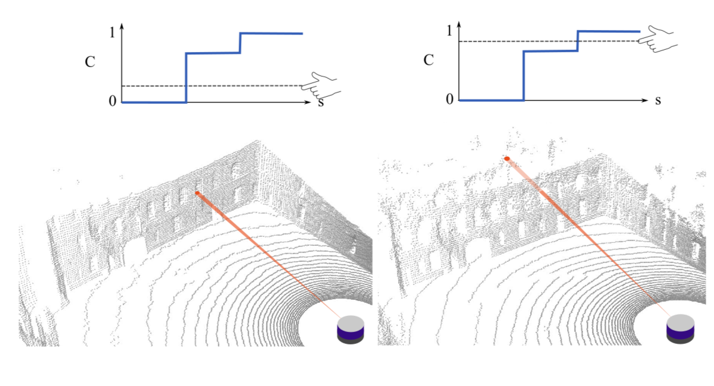

# PLINK
**P**robabilistic **Li**DAR **N**eRF **K**odebase

> 🚧 **Work in Progress** 🚧  
> This repository is currently under active development. Expect changes and updates.

## Novel Viewpoint Generation
PLINK can be used to generate high quality synthetic LiDAR scans from previously unvisited locations. In the demo below, given a noisy trajectory of raw data (left), PLINK is able to accurately produce new LiDAR scans along an arbitrary sensor trajectory within that space (right).
PLINK is particularly well suited for handling unstructured and noisy enviornments with porous and partially reflective surfaces.

<table>
  <tr>
    <td style="text-align: center;">
      <strong>Raw LiDAR data used to train PLiNK</strong><br>
      
    </td>
    <td style="text-align: center;">
      <strong>Synthetic LiDAR Scans Generated by PLiNK</strong><br>
      
    </td>
  </tr>
</table>

# Learning a probabilistic world representation from LiDAR data 


<!-- A LiDAR sensor emits a pulse of near-infared light and uses time of flight to estimate distance to a reflecting surface.  -->
Consecutive pulses from a static LiDAR sensor should in theory return the same range measurement every time. In practice, the interplay of semi-transparent surfaces, beam divergence, fluttering of loose foliage, discretization effects, and high sensitivity at sharp corners inevitably introduces a level of stochasticity into recorded data.
PLiNK rexamines the process through which a NeRF can be trained from LiDAR data in order to reconsile this difference from deterministic RGB data. 

<!-- In the image domain, "floaters", a common (but undesirable) artifact produced by NeRFs, are clouds of disconnected material that the model learns to reproduce apparent features in training images, but do not correspond to actual surfaces in the real world.  -->
Because 3D structure is learned indirectly when training off image data, "floater" artifacts are produced in situations where degenerate geometry under-constrains the multi-view reconstruction problem. Training directly on depth information from LiDAR data alleviates this ambiguity, however, conflicting LiDAR data over-constrains the problem, introducing another kind of "phantom surface" as shown below. Attempting to directly optimize conflicting depth measurements using the traditional NeRF L2 loss regime will cause the network to learn phantom surfaces at comromise locations.


By formulating loss as an integral of probability (rather than as an integral of optical density) PLiNK allows a network to learn multiple peaks for a given ray, allowing the sampling of first, $\text{n}^{\text{th}}$, or strongest returns from a single output channel. 

In the figure below, the inverse cumulative distribution can be set to a low value to render nearest returns (left), a high value to render more distant returns (right). The two renderings are different for directions viewing semi-transparent surfaces (windows) but identical for solid surfaces (walls).



The gif below demonstrates the resulting point clouds for a constant sensor pose as C is adjusted between (0,1]. For values close to 0, the rendering process produces points placed mostly on the first surface in each look direction, such as on windows and on the outermost leaves of the tree.  


Allowing the implicit representation to learn multiple peaks along a given ray allows PLiNK to outperfrom current SOTA LiDAR-based NeRF implementations. 

#### If you use this work, please cite it using the following BibTeX entry:

```bibtex
@article{mcdermott2024plink,
  title={A Probabilistic Formulation of LiDAR Mapping With Neural Radiance Fields},
  author={Matthew McDermott and Jason Rife},
  year={2024},
  journal={ArXiV (expected release 10/12)}
}
```

# TODO List

- [X] Set up project repository
- [X] Make Demo Gifs on Newer College Courtyard Scene
- [X] Figure out better acronym
- [X] Add citation link
- [X] Embed 10% vs 90% CDF figure
- [X] Benchmark performance on courtyard
- [X] Benchmark Performance on Mai City
- [X] Share interacive jupyter notebook demo
- [X] clean up utils for fine network
- [X] clean up utils for coarse network
- [X] Coarse to Fine notebook
- [ ] Link dataset
- [ ] Dataset preparation notebook
